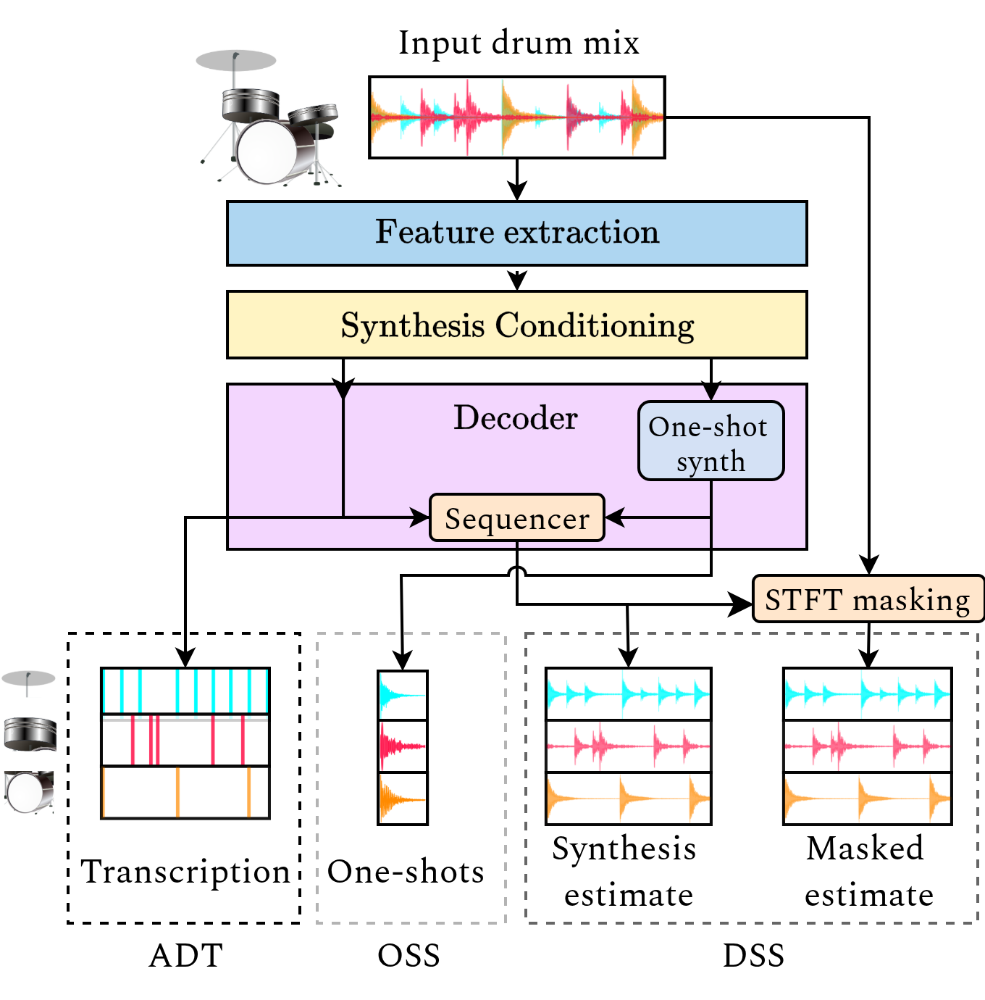

# Inverse Drum Machine (IDM)

[](https://arxiv.org/abs/2505.03337)
[](https://bernardo-torres.github.io/projects/inverse-drum-machine/)

This repository contains the official implementation of the paper: **"The Inverse Drum Machine: Source Separation Through Joint Transcription and Analysis-by-Synthesis"** ([paper link](https://arxiv.org/abs/2505.03337)).

IDM does Drum Source Separation (DSS) using analysis-by-synthesis combined with deep learning. Unlike traditional supervised methods that require isolated stem recordings for training, IDM is trained to reconstruct full mixes using transcription annotations as supervision.

- IDM is trained using only drum mixtures and their corresponding transcriptions, eliminating the need for isolated stems.

- The model jointly trains for Automatic Drum Transcription (ADT) and One-shot drum Sample Synthesis (OSS) in an end-to-end manner.

- IDM is comparable to state-of-the-art supervised methods while using approximately 100 times fewer parameters.

- The modular architecture allows for optional external information, such as corrected transcriptions, to be provided at inference time.

<!-- add a small note in italic here-->

\*_Pre-trained model weights and evaluation code will be added very soon, for now only the training and inference code is available._

### System Architecture

IDM is composed of three main modules:

<table border="0" cellspacing="0" cellpadding="10">
<tr>
<td valign="top">
<ol>
<li><strong>Feature Extraction:</strong> A ConvNeXt encoder extracts frame-level features from the input Log-Mel Spectrograms.</li>
<li><strong>Synthesis Conditioning:</strong> This module transforms the features into synthesis parameters: transcription onsets, velocities, individual track gains, and a conditioning vector for the one-shot synthesizer.</li>
<li><strong>Decoder:</strong> A one-shot synthesizer and a sequencer work together to reconstruct the individual drum tracks. The one-shot synth is a Temporal Convolutional Network (TCN) conditioned on instrument type and mixture embedding via FiLM. The sequencer is implemented using FFT multiplication.</li>
</ol>
</td>
<td valign="top" width="250">

</td>
</tr>
</table>

## Installation

This project uses Poetry for dependency management. The following steps assume you are working in a Python 3.10+ environment (you can create one as such `conda create --name idm python=3.10`).

1.  **Install Poetry:** If you don't have Poetry installed, follow the instructions on the [official website](https://python-poetry.org/docs/). One way is to run the following command inside your python environment:

    ```bash
    curl -sSL https://install.python-poetry.org | python3 -
    ```

2.  **Clone the repository**

3.  **Install dependencies:**
    ```bash
    poetry install # Install main dependencies
    poetry install --with dev # Install development dependencies (wandb, jupyter, etc.)
    poetry install --with nmf # Install nmf dependencies (e.g. TorchNMF)
    poetry install --with dev,nmf # Install all optional dependencies
    ```

## Usage

The `demo.ipynb` notebook provides a comprehensive guide on how to use the pre-trained models for drum separation.

Here is a basic example of how to load a model and process an audio file:

```python
import torch
from idm.inference import load_model, separate

# Load the pre-trained model
device = torch.device("cuda" if torch.cuda.is_available() else "cpu")
model, name = load_model('idm-44-train-kits', device)

# Separate the drum stems from an audio file
drum_loop_44_1khz = "path/to/your/drum_loop.wav"
output_dir = "output/separated"
separate(drum_loop_44_1khz, model, output_dir=output_dir)
```

## Training

To train the model, you can use the provided `run.py` script with the desired configuration files. The main configuration is `configs/train.yaml`, which can be customized as needed.

## Results

For detailed results, audio examples, and comparisons with baseline models, please visit the accompanying project website: [https://bernardo-torres.github.io/projects/inverse-drum-machine/](https://bernardo-torres.github.io/projects/inverse-drum-machine/)

## Citation

If you find this work useful in your research, please consider citing the following paper:

```
@article{torres2025inversedrummachine,
title={The Inverse Drum Machine: Source Separation Through Joint Transcription and Analysis-by-Synthesis},
author={Torres, Bernardo and Peeters, Geoffroy and Richard, Ga{\"e}l},
journal={IEEE Transactions on Audio, Speech and Language Processing},
year={2025},
doi={10.1109/TASLPRO.2025.3629286}
}
```

## TODO

- [ ] Evaluation code
- [ ] Model weights
- [ ] Add baseline instructions
- [ ] Add StemGMD preprocessing instructions
- [ ] Callbacks for logging audio samples during training

<!-- - Baselines:

Larsnet: put pretrained models in folder larsnet/pretrained_models. exampel path project_root/larsnet/pretrained_models/hihat/pretrained_hihat_unet.pth
or change the path in configs/baselines/larsnet/config.yaml (under inference_models) -->
